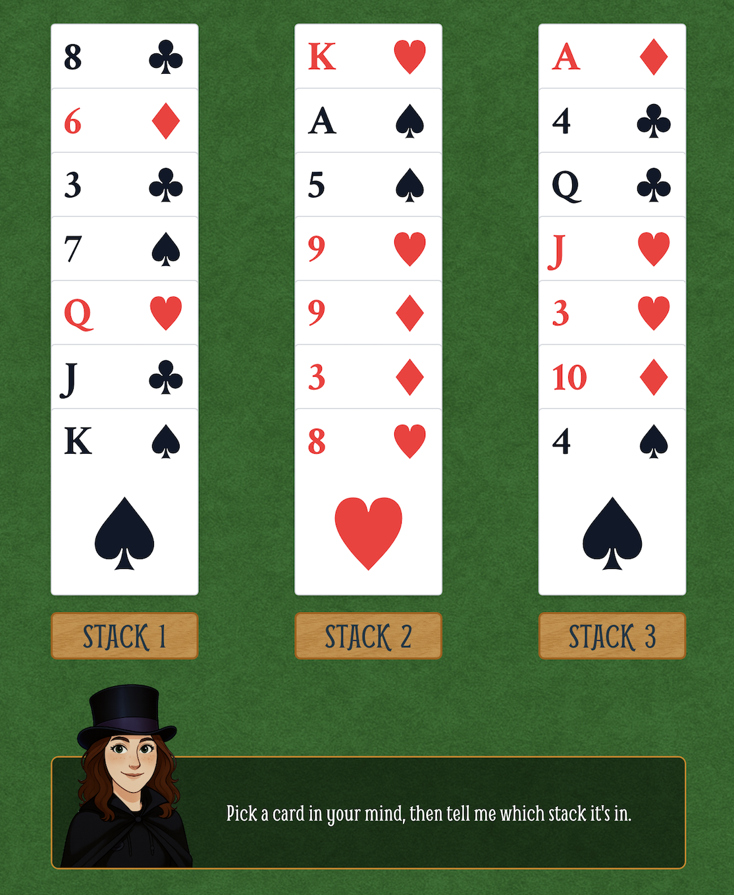
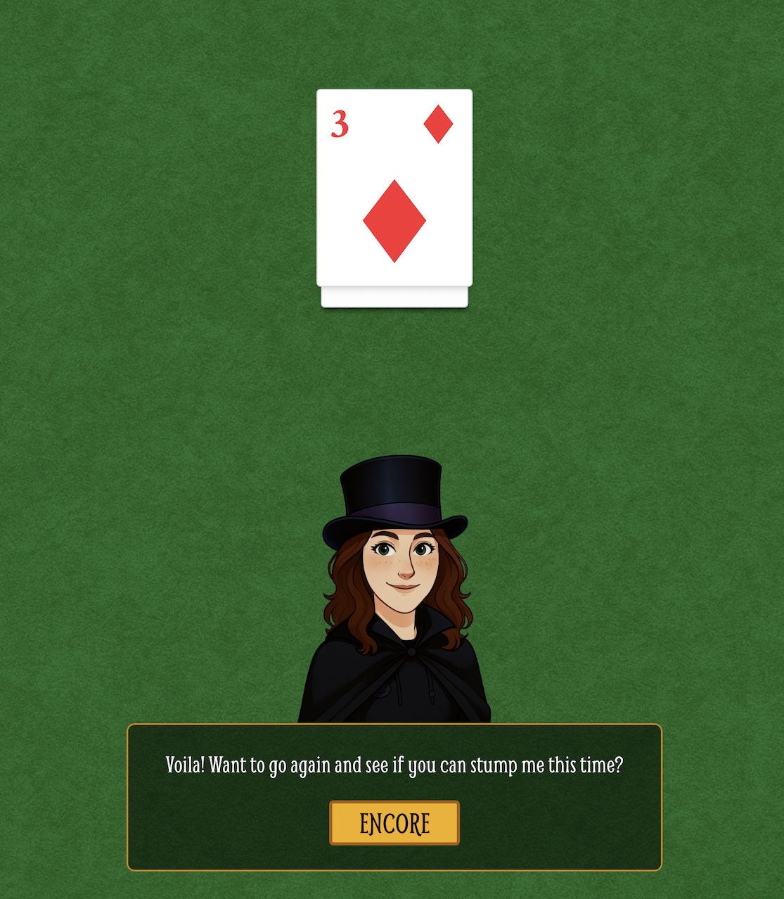

# 21 Card Trick 


A playful and interactive React/TypeScript implementation of the classic 21 card trick. Deal cards in 3 stacks, ask the player which stack contains their secret card, gather the stacks with the chosen one in the middle, and after 3 rounds… reveal the card in position 11. ✨

> Built with **React + TypeScript**, **XState** for state management, **Framer Motion** for animations (`motion/react`), and **Tailwind CSS** for styling.

## Live Demo

- **Live demo:** coming soon!
- **Screenshots:**






## Features

- 🎴 Authentic 21 card algorithm ( deterministic reveal at index 11 )

- 🧠 XState state machine for clear app flow

- 💬 In‑app dialogue box that anchors at the bottom

- 🎞️ Smooth animations using Framer Motion (motion/react)

- 🎉 ConfettiBurst on reveal

- 🎨 Tailwind CSS utility‑first styling

## Tech Stack

- **Language:** TypeScript
- **Framework:** React
- **State Management:** XState
- **Animation:** Framer Motion (`motion/react`)
- **Styles:** Tailwind CSS
- **Build Tool:** Vite

## Getting Started

### Prerequisites

- Node.js ≥ 18

### Installation 

```
# clone
git clone <your‑repo‑url> 21-card-trick
cd 21-card-trick

# install deps
npm install
```

### Development

```
npm run dev
```

App will start on something like `http://localhost:5173/` (Vite default)

### Production Build

``` 
npm run build
npm run preview
```

### How the Trick Works (Algorithm)

1. Start with **21 unique cards.**
2. Deal into **3 columns of 7** cards each (left -> right, top -> bottom)
3. Ask the player: *Which stack contains your card?*
4. **Gather** the stacks with the **chosen stack in the middle.**
5. Repeat **steps 2-4** for a total of **3 rounds.**
6. After the 3rd gather, the selected card will be at **index 10** (0-based) -> **position 11** (1-based). 

### App Flow (XState)

```
stateDiagram
INTRO --> DEAL
DEAL --> ASK
ASK --> GATHER
GATHER --> DEAL: round < 3
GATHER --> REVEAL: round === 3
REVEAL --> RESET
```

- **INTRO:** welcome the user
- **DEAL:** lay out 21 cards (3 stacks x 7 cards)
- **ASK:** user selects the stack containing their card
- **GATHER:** reorder with chosen stack in the middle; increment round counter
- **REVEAL:** animate and reveal card at position 11; confetti 🎉


### Contributing 

PRs and suggestions welcome. For significant changes, please open an issue first to discuss what you'd like to change. 

### License 

Code: MIT © 2025 Megan Smith

### Contact

- **Author:** Megan Smith
- **Portfolio:** coming soon!
- **LinkedIn:** https://www.linkedin.com/in/megelismi/


